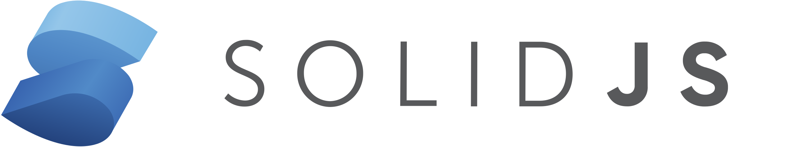

<div align="center">
  <picture>
    <source media="(prefers-color-scheme: dark)" srcset="apps/website/public/images/oceanui-og-dark.gif" />
    <source media="(prefers-color-scheme: light)" srcset="apps/website/public/images/oceanui-og-light.gif" />
    
  </picture>
</div>

<br />

<div align="center">
  <h1>🌴 Ocean UI</h1>
  <p>
    <strong>Beautiful Components for Design Engineers</strong>
  </p>
  <p>
    A collection of copy-&-paste components for quickly building application UIs.<br />
    It's open-source and built with Tailwind CSS and Ark UI.
  </p>
  
  <p>
    <a href="https://components.prashantindurkar.in">Documentation</a> •
    <a href="./ROADMAP.md">Roadmap</a> •
    <a href="./CONTRIBUTING.md">Contributing</a> •
    <a href="./LICENSE">License</a>
  </p>
</div>

---

## ✨ Features

- 🎨 **Beautiful Design** - Carefully crafted components with attention to detail
- ♿ **Accessible** - Built on Ark UI for superior accessibility standards
- 🔧 **Framework Agnostic** - Supports React and SolidJS (with more coming)
- 📦 **Copy-Paste Philosophy** - Own your code, customize freely
- 📱 **Responsive** - Mobile-first design approach
- 🎯 **TypeScript** - Full type safety out of the box
- 🎨 **Tailwind CSS v4** - Modern utility-first styling

## 🎯 Supported Frameworks

Ocean UI currently supports the following frameworks with official integration guides:

<div align="center">
  
| [](https://components.prashantindurkar.in/docs/documentation/integration/nextjs)<br />**Next.js** | [](https://components.prashantindurkar.in/docs/documentation/integration/solidjs)<br />**SolidJS** |
|:---:|:---:|
| Next.js integration | SolidJS integration |

</div>

## 🚀 Quick Start

Visit our [documentation site](https://components.prashantindurkar.in) to browse components and copy code directly into your project.

Each component is:

- ✅ Production-ready
- ✅ Fully accessible
- ✅ TypeScript typed
- ✅ Customizable via props and className
- ✅ Framework compatible

## 📚 Documentation

Browse all available components, view live demos, and copy code directly from our documentation:

**[→ View Documentation](https://components.prashantindurkar.in)**

## 🗺️ Component Roadmap

Track our progress and see what's coming next! We're building a comprehensive set of ARK UI components, organized by category and prioritized for fast shipping.

**[→ View Roadmap](./ROADMAP.md)**

**Current Status:**

- ✅ **1 component** completed (Accordion)
- 🚧 **34 components** planned across 6 development phases
- 🎯 Focus on high-usage, low-complexity components first

## 🛠️ Development

### Prerequisites

- Node.js 18+
- pnpm (recommended) or npm
- TypeScript 5+

### Setup

```bash
# Install dependencies
pnpm install

# Build all packages
pnpm build

# Run development server
pnpm --filter @ocean-ui/website dev
```

For detailed development guidelines, see [CONTRIBUTING.md](./CONTRIBUTING.md).

## 🤝 Contributing

We welcome contributions! Whether it's adding new components, improving existing ones, or fixing bugs, your help makes Ocean UI better for everyone.

See [CONTRIBUTING.md](./CONTRIBUTING.md) for detailed guidelines.

## 🙏 Built With

Ocean UI is built on top of amazing open-source projects:

- [Ark UI](https://ark-ui.com) - Headless UI components
- [Zag.js](https://zagjs.com) - State machine primitives
- [Tailwind CSS](https://tailwindcss.com) - Utility-first CSS framework

## 📄 License

See the [LICENSE](./LICENSE) file for details.

---

<div align="center">
  <p>Made with ❤️ by the Ocean UI community</p>
  <p>
    <a href="https://components.prashantindurkar.in">Documentation</a> •
    <a href="./ROADMAP.md">Roadmap</a> •
    <a href="./CONTRIBUTING.md">Contributing</a> •
    <a href="./LICENSE">License</a>
  </p>
</div>
